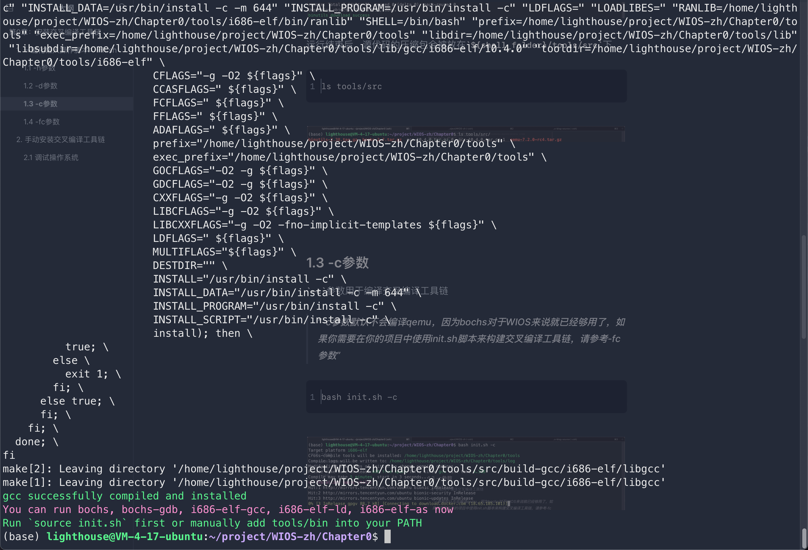

# Chapter 0: Installing Development Tool Chain

To write an Operating System, we need to prepare a series of tools, which will be installed in this chapter. These tools together are called the development toolchain.

> Strictly speaking, the kernel is not equal to Operating System. OS = kernel + peripheral services (like X system which provide GUI service). But I will use both OS and kernel alternatively. **In this book, We don't distinguish subtle semantic differences between kernel and OS, we regard them are the same thing**.

The development tool chain mainly includes **cross-compiling toolchain**  and **debugging virtual machine**.

> we introduce what is cross-compilation [right after](#cc)

## 1. Introduction of Development Tool Chain


### 1.1 Development Procedure

In the next few chapters, the procedure for developing our kernel is:

- Writing codes (kernel)
- Compiling kernel
- Debugging kernel


#### 1.1.1 Writing Codes: Editor

For writing codes, there are a bunch of editors for us to use, e.g., `VSCode`, `Vim`, `gedit`, `nano`, `Emacs`, etc. Each one of these editors is competent to write the kernel.


#### 1.1.2 Compiling Codes: Cross-Compiler

> <span id="cc">Why we need cross-compiling</span>

In short, **compiling the kernel requires a cross-compiling toolchain for the target platform**. 

**CPU is a kind of hardware or a kind of complex circuit**. It can recognize a set of instructions and activate different sub-circuit. Different sub-circuit plays different roles. Some sub-circuit can access memory, and some can connect and process interrupts send from 8259A (A kind of Programmable Interrupt Controller, we will cover it in future chapters).

Imagine if different CPU supports different instruction set, it could be a disaster to write a program. Same functionality, but different instructions. In reality, there are a few instruction sets that are well accepted, e.g., the `x86` instruction set, the `arm` instruction set, etc. **With these well-accepted instruction sets, a newly designed CPU needs to be compatible with these existing instruction sets**, i.e., the new CPU should be able to recognize these instruction sets and realize prescribed functionality.

**Like CPUs have different generations, instruction set like `x86` also have different versions**. Usually, the later version is compatible with the earlier version. **But the CPU designed based on earlier instruction sets cannot run later instruction sets.**

So, if we are going to write an operating system running on the `Intel 80686` CPU, the instruction of the operating system after compilation should be `Intel 80686` compatible.

But we are writing C code in alphabets, while the design of the CPU circuit determines it can only recognize binary instruction sequences like 01000100001110, rather than alphabets. How to let the CPU run our codes?

**The answer is compilation**. The process of compilation is similar to translation. The compiler (e.g., `gcc`, `clang`) translates alphabetic source code into binary CPU-recognizable instructions. **After compilation, the alphabetic source code becomes a binary instruction program.**

As said before, the CPU can only run a program consisting of compatible instructions. Same C source code, if we use a compiler that generates `arm` instructions, the generated program cannot run on the `x86` architecture CPU. Since the `x86` architecture CPU cannot recognize `arm` instructions, and also doesn't have corresponding circuit realization.

So, if we are using an `Intel` CPU computer to develop a kernel that runs on an `arm` CPU. We need a compiler that runs on `Intel` CPU but generates `arm` instructions. **Such compiler is called cross-compiler, for its host platform (where the compiler is running on) is different from the target platform (where the generated program will run on).**

For WIOS, it will run on the `Intel 80686` CPU, so we need a cross-compiler that runs on our computer and generates an `Intel 80686` CPU.

Luckily, we can use `gcc` as a cross-compiler. DO NOT try to `yum install gcc` or `apt install gcc`. Because the downloaded `gcc` regards the target platform as the host platform by default. Kernel compiled using such `gcc` cannot run on the `Intel 80686` platform.

We need to compile a new `gcc` that runs on our platform and generates target platform instructions. Don't worry, I'll cover them shortly below.


#### 1.1.3 Debugging Codes: Virtual Machine

After we have a kernel consisting of `Intel 80686` CPU-compatible instruction through compilation. How should we run such a kernel and debug the kernel? I believe most of us don't own an `Intel 80686` CPU.

The answer is using a `Virtual Machine` to simulate the `Intel 80686` CPU. The kernel doesn't care what CPU we have, it only cares whether its instructions can be interpreted and executed.

The virtual machine could let our more advanced CPU, like the `Intel i9-10900K` CPU, pretends to be an `Intel 80686` CPU by recognizing and interpreting `Intel 80686` compatible instruction sets. Remember what I said before? CPU designed on modern instruction sets usually is compatible with the previous version.


## 2. Manually Install Development Tool Chain

Although I provide a one-click download, compiling bash shell, I still hope you read this section. It introduces some knowledge.

### 2.1 Editor

Whatever you like. For me, I prefer using `VSCode`, since we need to write both C and assembly codes.


### 2.2 Cross-Compiler

The cross-compiler contains `binutils` and `gcc`. 

First, download the source code of `binutils` and `gcc`

```shell
wget https://ftp.gnu.org/gnu/binutils/binutils-2.38.tar.gz
wget https://ftp.gnu.org/gnu/gcc/gcc-10.4.0/gcc-10.4.0.tar.gz
```

> You can also visit https://ftp.gnu.org/gnu/binutils/ and https://ftp.gnu.org/gnu/gcc/ to download your favorite version.

And then, declaring some environment variables before compilation and installation.

```shell
export PREFIX=<the-location-where-cross-compiler-will-be-installed>
export TARGET=i686-elf
export PATH="$PREFIX/bin:$PATH"
```

> WIOS will run on the `Intel 60686` CPU, so we set the target platform as i686-elf.

Next, compile binutils.

```shell
tar xzvf binutils-x.y.z.tar.gz

mkdir build-binutils
cd build-binutils
../binutils-x.y.z/configure --target=$TARGET --prefix="$PREFIX" --with-sysroot --disable-nls --disable-werror
make
make install
```

> `x.y.z` is the version number. Please replace it with the version number of `binutils` you download.

Finally, compile ` gcc`.

```shell
tar xzvf gcc-x.y.z.tar.gz

# The $PREFIX/bin dir _must_ be in the PATH. We did that above.
which -- $TARGET-as || echo $TARGET-as is not in the PATH

mkdir build-gcc
cd build-gcc
../gcc-x.y.z/configure --target=$TARGET --prefix="$PREFIX" --disable-nls --enable-languages=c,c++ --without-headers
make all-gcc
make all-target-libgcc
make install-gcc
make install-target-libgcc
```

> `x.y.z` is the version number. Please replace it with the version number of `gcc` you download.


### 2.3 Debugging the operating system

We use the virtual machine to simulate the target platform and debug our kernel. But at present, there are many virtual machine software we can use, such as `VMWare`, `VirtualBox`, etc.

But virtual machine software like `VMWare` focuses on running an operating system instead of debugging the operating system by step. So what we need is virtual machine software that provides an interface for debugging.

Currently, some popular virtual machine software that supports debugging the operating system is `Bochs` and `QEMU`. `Bochs` is more lightweight but not as powerful as `QEMU`. For `WIOS`, both `Bochs` and `QEMU` are competent.


> When debugging WIOS in the next few chapters, I will use `Bochs`, because I'm more familiar with `Bochs`


#### 2.3.1 Compile Bochs

Download the source code first

```bash
wget https://sourceforge.net/projects/bochs/files/bochs/2.7/bochs-2.7.tar.gz
```

> you can also visit the `Bochs` webpage on `SourceForge` to download the source code: https://sourceforge.net/projects/bochs/files/bochs/.

Then install the dependencies needed at compile time.

```shell
sudo apt-get install build-essential xorg-dev libgtk2.0-dev bison
```

Next, compile and install Bochs.

```shell
sudo tar xvzf bochs-2.7.0tar.gz
cd bochs-2.7.0
# The bochs compiled by the following configuration do not support gdb debugging, and only the debugger that comes with bochs can be used.
./configure-prefix = installation directory-enable-debugger-enable-iodebug-enable-x86-64-with-x-with-X11.
# The bochs compiled by the following configuration support gdb debugging. You can use gdb or gdb in vscode to link bochs debugging.
./configure-prefix = installation directory-enable-GDB-stub-enable-iodebug-enable-x86-64-with-x-with-X11.
make
make install
```

> if you don't specify the `--PREFIX` parameter, it will be installed to the ` /usr/bin ` folder by default, and ` sudo make install ` is needed at that time.


#### 2.3.2 Compile QEMU

The compilation of QEMU' is much simpler than that of Bochs'.

Download the source code first

```shell
wget https://download.qemu.org/qemu-7.2.0.tar.xz
```

Then unzip, compile, and install QEMU.

```shell
tar xvJf qemu-7.2.0.tar.xz
cd qemu-7.2.0
./configure
make
```

> QEMU uses `ninja` as the building system, there is no need to `make install`. `ninja` will install `QEMU`


## 3. One-click lazy script: init.sh

To facilitate learning, I provided a script `init.sh`, which installs all tools with one click.

### 3.1 -h Option

Use the `-h` option to get help information of the script.

```shell
bash init.sh -h
```


### 3.2 -d Option

Use the `-d` option to download the source codes of the development toolchain.

> The script decides to use either `wget` or `git clone` to download the source code according to your network status

```shell
bash init.sh -d
```


After running, the tarball archive of all source code will be placed under ` ${shell_folder}/tools/src `.

```shell
ls ./tools/src
```


### 2.3 -c Option

The `-c` option will compile all tools.

> -c parameter will not compile `QEMU` by default, because bochs is enough for WIOS. Please use `-fc` option if you need to use init.sh script in your project to build a cross-compilation toolchain.

```shell
bash init.sh -c
```




You can modify the value of `PREFIX` in `init.sh` to specify the location where all tools will be installed after compilation.

> the default installation location is: `<path-to-WIOS>/tools/bin`.

```bash
ls tools/bin
```


To enable command line completion of cross-compiling tools, we need to add the installation folder to `PATH`.

This step is also realized in `init.sh`. Run the following command to add it.

```shell
source init.sh
```


Then we enter `i686-elf<Tab><Tab> ` and the completion will appear, including using `which` to search.

```shell
i686-elf-<Tab><Tab>
which i686-elf-gcc
```


### 2.4 -fc Option

The `-fc` option compiles `QEMU` based on the `-f` option.

```shell
bash init.sh -fc
```


