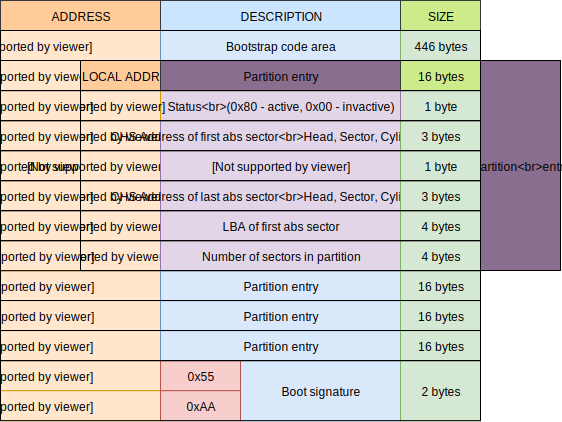

# Chapter 1: Composition and Startup of Computer

In this chapter, we will begin first step of devloping an operating system: start the computer. Before knowing how computer starts, we need to learn the hardware composition of the computer first.

> To make it easier for people with no background knowledge to understand it, I try to explain it in the simplest language. So, there may be some imprecisions, please forgive it. Issues for proofread is welcomed.

Part of the resources in this chapter are quoted from [Yugang Tan's course of computer hardware on `bilibili`](https://www.bilibili.com/video/BV1dz4y1z7e4/?vd_source=214871085a518d6559a5be7d13ee2374)


## 1. Hardware Composition of Computer

> Operating System is a software that closely combined with hardware, so before writing the operating system, we need to have background knowledge of computer hardware.

 

`CPU` is not a device that can work alone. `CPU` can only do calculation, i.e., addition, subtraction,multiplication, and division. It take no responsibility for storing the operands and results. So, the operands and result need to be stored in external memory. Similarly, the result needs to be displayed to the user through display. Users are also required to input operands from keyboard and mouse...

 

Therefore, `CPU` is merely a component of a computer. To work as expected, `CPU` needs the support of other devices such as memory, graphic card, keyboard, and mouse. Besides, power supply and heat dissipation are also prerequisite.


There are many metal contacts on the back of CPU. These contacts are acutally power supply, address line, data line, and so on. These metal contacts are called `Pin`.


The data transmission between CPU and mouse, keyboard, hard disk, monitor, and other devices is completed through these pin.

 


 

**In order to connect `CPU` with memory, hard disk, screen, mouse, and keyboard, enabling data circulation between these devices, people have designed a circuit board that can connect all devices. This board is called  `Motherboard`** 

Motherboards are not only in computers, but also in mobile phones, even in computer-controlled devices such as microwave ovens and washing machines. Just much smaller than those on computers, also far fewer devices connected.

**`Motherboard` is actually a stack of multi-layer circuits**. Layers are isolated from each other by insulating glue. Therefore, each layer on the motherboard can be regarded as a single circuit, or a wire with special functions


 

The `motherboard` has a lot of sockets on it. Therefore, the `motherboard` can connect many kinds of devices.


 

The only thing you need to do is putting the CPU on the CPU socket on the motherboard, if you want to connect the CPU to the current motherboard. After that CPU is connected to motherboard through the metal contacts at the bottom. 


Similarly, wo can also plug memory through the memory socket on the motherboard. With CPU and memory plugged, the CPU is connected with the memory through some circuits inside the motherboard. CPU and memory can transmit data now.

 

< img src = "./assets/image-2022111922832114. png" alt = "Memory module and CPU exchange data through the circuit on the motherboard" style="zoom:33%; " />


For display, we plug in a graphic card and connect the monitor to the motherboard.


To get user input, we plug in the mouse and keyboard.


If there is no power, the computer can't work. So, we also need to connect the motherboard with electricity, i.e., connecting the motherboard with a power module.


 

Finally, a decent computer was built.

 

> Above words are actually a simple introduction to the hardware composition of the computer. In fact, there are many chips integrated on the motherboard, such as interrupt controller, arbiter, etc...
>
> In the future, we will introduce them one by one. Learning is from shallow to deep. We introduce simple and easy-to-understand content at first. Then, gradually to slowly difficult contents later.

 

## 2. First step of booting: turning on the power 

> some reader may wonder, shouldn't the computer start after we pressing the power button?
>
> No! In fact, the computer has started once after the power was turned on. 

Next, we will explain the first step of booting: `turning on the power`.


### 2.1 What is turning on the power?

Some reader may wonder why do I have to talk about connecting the power supply? Isn't plugging the adapter plug into the socket? 

No! In fact, for a desktop computer without internal power supply, plugging the plug into the socket is connecting the power. But for computers with built-in power supply such as mobile phones, pads, laptop, as long as the battery not running out, the computer is connected to the power supply.

 

In a word, at the moment that we turn on the power for the computer, the power comes to the motherboard and lasts. But that doesn't mean all devices get power. The power has not been delivered to all the hardware.


 

### 2.2 Step 1: Power the clock module1

After the power is delivered to motherboard, the first module getting powered on is the `clock module` on the motherboard. **`Clock module` is a special circuit, which sends out a signal of `high-low-high-low`, as long as the power is on.**

 

This signal is called `clock signal`. Different devices on the motherboard rely on `clock signal` to work properly. A sinple illustration is once they detect the rising edge of the clock signal, they execute some functionality. For example, the CPU starts to add after detecting the first rising edge, and finish the additon in this clock cycle. After detecting the next rising edge, the CPU saves the calculation result to the memory.


In this way, each component of the whole system cooperates well with the help of the clock signal. Some times they actually works asynchronously, but the clock signal still plays important role.


 

The clock circuit is mainly composed of a clock generator, 14.318MHz crystal oscillator, capacitor, resistor and inductor, etc. We don't need to know how the clock circuit is achieved physically. What we need to know is that all circuits and hardware in the computer needs a clock signal to work properly. Therefore, the first module got powered on after the motherboard got power is the clock module.

 

**Please pay attention, powering on the clock module means that the clock circuit is ready to work. It doesn't start to send out clock signal until we press the power-on buttion. After pressing, clock signals of different frequencies are sent to various hardware.**


 

 ### 2.3 Step 2: Catch Up Startup Signal

After the clock module is workding, the next step of booting is the to catch up the startup signal by the startup circuit.

Basically speaking, when you press the startup button, you send a startup signal. There's a startup circuit connect to the startup button. Once you press the button, you just activate the circuit, and startup signal are sent to the motherboard.

Before the startup signal, motherboard is powered but no power is delivered to devices like CPU, GPU, memory, and etc. So before the startup signal, most hardwares in the computer has not been powered on.


But now, right after the clock module is powered on, the next module to power on is the startup module since we haven't press startup button, 


 

## 3. Second step of booting: after pressing the power button 

After we press the boot key, a startup signal is send to all devices through motherboard. And then, power is delivered to all devices, which means the first part of booting process is over.


From now on, the computer start the next part of booting process. In the following passage, we will explain what happened after startup button was pressed. 

 

### 3.1 Step 1: Hardware Self-check

After we press the power button, the startup circuit detects we pressing the power button, the motherboard will receive startup signal sent by the power.

After receiving the startup signal, the motherboard will first check whether there is any short circuit or leakage on the motherboard. If there is, the motherboard will interrupt the booting and cut off the power supply. If not, the motherboard will continue to supply power and continue the booting process.

300\~500ms after the motherboard self-test is completed, a "PowerGood" signal will send to clock module. After receiving this signal, the clock module starts to work and sends out clock signals with different frequencies to various devices on the motherboard.

Besides, power is also delivered to each devices.

 

 

### 3.2 Step 2: CPU Reset When Power On

 The first thing to do when a device get powered is to reset itself, including `CPU`.


When the CPU is reset, it will initialize the `CS` and `IP` registers to specific values. How to reset it is actually realized by hardware circuit design.

 

> As we said before, when debugging our own operating system in the future, we will use a virtual machine to simulate a computer. The simulation what happens after we press the power-on button, so we will use the virtual machine to see what values `CS` and `IP` are set to.

 

### 3.3 Step 3: Reset All Device

After the clock module starts to send clock signals to all devices, not only the CPU will be initialized, but other components as well.

> To pave the way for the later operation of the operating system, we emphasized the reset of ` CPU'.
>
> We emphasize `CPU` here to echo the content in next chapter where we will detail the working mechanism of `CPU`


### 3.4 Step 4: Run the BIOS program.

 After all devices on the motherboard is reset, the CPU can start running now. But there is a problem at this time, i.e., which program should we run first?


Because current architecture of computers are von Neumann architecture. **For all computer based on von Neumann architecture, the `CPU` (arithmetic unit and controller) is only responsible for fetching instructions, interpreting instructions and executing instructions. All instructions are stored in memory. **


 

A simpler explanation is that the CPU is only responsible for calculation (addition, subtraction, multiplication and division). But what calculation should do in the next clock cycle is determined by instructions stored in memory. The CPU needs to read the next instruction in the memory before starting the calculation.

> I have always wondered why `CPU` can fetch, interpret and execute instructions when I first know von-Neumann architecture. How do `CPU` realize fetching, interpreting and executing? 
>
> After years, I finally realized that these are all realized by the circuit design of `CPU`. Different `CPU`s have different way to realize.


However, there is no instruction in the memory when memory just resets. In other words, when `CPU` just start to run, there is no program in the memory, so what program should the `CPU` run at this time?

**So, at this time, we need a builtin programs inside `CPU`, which is to say, CPU can run this program right after `CPU` resets.** And the function of this program is to read other programs from the disk, and load them to the memory. Finally, when the builtin program ends CPU` start to execute newly loaded program.

And all data in the memory will be lost when the power is cut off. This program should exist without power. This program is called `Basic Input Output System` (`BIOS`). The name of this program is strange at first glimpse. But in essence, `BIOS` is a program, which has no difference from Twitter and YouTube we use. From the perspective of CPU, all of them are instruction sequences.


In the 1970s, people invented a chip called `ROM` (`read only memory`). Like memory (`RAM`, `Random Access Memory`), `CPU` can access `ROM` directly, but the data stored in `ROM` will not be changed or lost after power off.

 

Therefore, `ROM` is suitable for storing `BIOS`. Nowadays, there do is a special `ROM` on the motherboard which stores `BIOS`. Over times, `BIOS` sometimes refers to the program started when the computer is powered on, and sometimes refers to the `ROM` that stores the BIOS program.


> How does CPU access `ROM` will be explained in the next chapter.

 

At the end of running, `BIOS` will search the disk for the operating system to boot. And when the operating system is found, `BIOS` will load the operating system from the disk, store a copy to the memory, and then start running the operating system.


From now on, we formally take over the startup process of the computer. What computer will do next depends on the the code we write.

> When reader reaches here, please finish [project 1: Running BIOS](#project1).
>
> This project will help you get a direct feeling of `BIOS`


## 4. Disk and MBR Sector

As we said above, `BIOS` will look for the operating system on the disk at the end of the program. So, let's talk about disks and disk images first. Then explain the `MBR` sector.


### 4.1 Disks and Disk Images 

**Disk is a device that can store binary data**. Physically, different types of disks have different storage method. For example, traditional `Hard Disk Drive` （`HDD`) uses the north and south magnetic poles of magnetic substances to represent 01, and `Solid-State Disk` （`SSD`) represents 01 by the number of electrons.

> In the early days, computers used Floppy Disk, but now most common one is Hard Disk Drive.
>
> Later in this article, we may use `disk`, `hard disk` or `HDD` interchangeably to refer to `HDD`.

 

But no matter what the storage methods are, all types of disks are logically the same: **they can be regarded as binary strings of 0101010**.


**So if there is a binary file and each bit is the same to the corresponding bit in the disk. Then logically, this binary file is equivalent to this disk. **

In the future, when we save some files to disk and modify the some binary bits, if we ensure that the binary file do same modification. Then this binary file is still equivalent to the disk.

**Such binary file is just like a image of the disk mapped in a mirror. So this binary file is called `Disk Image`.**

Therefore, for virtual machines, we can use disk images to simulate disks. In the future, we will also burn the operating system to the disk image, so as to simulate burning the system to a flash or `HDD`.

 

### 4.2 Sector 

We said that the disk is logically a long binary data string. For example, a common $1TB$ HDD can store $879609302208$ bytes data.

 

If we imagine this hard disk as a long paper tape, then if we want to change the value of a bit now, we have to say that: set the value of the $991029129$-th bit to 1. How stupid it is!

 

**Therefore, to facilitate reading and writing the disk, we logically divide the disk into blocks, which are called `Sector`, also called `blocks`.** Each sectors are the same size, generally 512 bytes. Of course, due to the increasing disk size, some manufacturers set the size of each sector to 4096 bytes.

> If it is not emphasized, we  regrad a sector stores 512 bytes of data by default.

 

**In the future, we will operate the disk in sectors, rather than bits or bytes**. For example, we are ask to read the value of the $991029129$-th bit. There are 8 bits in a byte, so $991029129/(512 \times 8) = 251950 \cdots 1920 $, $1920/8 = 240$, that is, the $991029129$ bit is the $240$-th byte in the $251950$-th sector.

So we read to data of `251950`-th sector into memory, and then access the value of `240`-th byte to get the result.


### 4.3 CHS Addressing and LBA Addressing

After we separate the disk into blocks/sectors, the next question is how to access designated block, i.e., the addressing of disk.

There are two types of addressing:

- LBA addressing
- CHS addressing

We will cover them all.

#### 4.3.1 LBA Addressing 

The most direct addressing method is to start with assign 0 to the first block, then 1 for second block, 2 for third block,m and so on...

This addressings method is called `Logical Block Addressing` ( `LBA`).

The `LBA` addressing uses 28-bits or 48-bits to addressing blocks which are call `LBA28` address and `LBA48` address.

- `LBA28` can identify at most $2^{28} = 268435456 $ blocks, and each block is 512 bytes, so `LBA28` can addressing at most 1TB disk.

- `LBA48` can identify at most $2^{48} = 281474976710656 $ block, and each block is 512 bytes, so `LBA48` can identify at most 1048576TB.

And WIOS may be a few MB in the future. Therefore, it is quite sufficient for us to use `LBA28` for addressing disk.

 

#### 4.3.2 CHS Addresing 

> The following comtent is from [this article](https://techpubs.jurassic.nl/manuals/0620/admin/IA_DiskFiles/sgi_html/ch01.html)

CHS addressing is another way of addressing sectors. This method is related to the structure of the disk.

> Physical Disk Structure

A disk is composed of circular plates called `Platters`. Each platter has an upper and lower oxide-coated `surface`. Recording `heads`, at least one per surface, are mounted on arms that can be moved to various radial distances from the center of the platters. The heads float very close to the surfaces of the platters, never actually touching them, and read and record data as the platters spin around.


 

When the recording heads are at a particular position, the portions of the disk that can be read or written are called a `cylinder`. As shown in figure below, a `cylinder` is made up of rings on the upper and lower surfaces of all of the platters. 

The ring on one surface is called a `track`. Each track is divided into `blocks` (sometimes called `sectors`). For each disks, the number of disk blocks per cylinder may vary; outer cylinders may have more disk blocks than inner cylinders.

 

For sectors on a surface, we can use 0, 1, 2 to number them. So, each surface may have its own 0 sector. To locate a particular sector in the whole disk, we can use a `(Cylinder, Head, Sector)` tuple.

Above are how `CHS` addressing works.


> Currently, `LBA` addressing is widely used. Our WIOS will also uses LBA address to access disks.


### 4.4 MBR Sector

#### 4.4.1 What is MBR Sector?

**`Master Boot Record` (MBR) is actually the first sector in the disk, whose address is 0**. 

`MBR` sector records some key information of the current disk. The BIOS could know which sector holds the operating system is by reading the data in this sector.

####  

#### 4.4.1 Why is There an MBR Sector? 

As we mentioned earlier in the startup process of computer, the last step of the BIOS is to find the operating system in the disk. If fould, load the operating system into memeory, and the run the operating system. But there is a problem, the disk is so big, how can BIOS find the operating system in the disk?

Assuming that our disk is 1TB, it will take several minutes for BIOS to traverse this 1T disk. Just like GTA5 may take 6 minute to start, what a disaster! 

In fact, `BIOS` uses key information record in `MBR` sector to find the operating system.

The following picture is the `MBR` sector of the disk image which stores JackOS, the predecessor of WIOS.


  

#### 4.4.2 Layout of MBR Sector

The `MBR` sector is also a sector, so it can store 512 bytes of data. Key information about the disk is saved in merely 512 bytes. Every byte counts, so the Layout of `MBR` sector has been stipulated. 

People have carefully planned the `MBR` sector. The layput is as follows:

 


The MBR sector can be divided into three parts generally:

- 0-445 bytes: These 446 bytes store the bootstrap code. A very simple program is saved in this area.
- 446-509 bytes: These 64 bytes stpres partition tables, which indicate whether each partition has an operating system or not.
- 510 and 511 bytes: These two bytes are boot signature. They are fixed to `0x55AA` if there is a bootable os on the disk.

 


## 5. Third step of booting: from MBR to Loader

At the end of the second step of startup, we said that BIOS will look for the operating system in the disk. Before we dive deeper, we first introduce some knowledge about the disk. 

Let's continue to talk about the third step of computer startup.


### 5.1 Search MBR partition 

At the end of the BIOS program, it will first detect how many hard disks are connected to your computer. Then the first sector, i.e. MBR sector of each disk will be read into memory in by sequence.

After reading `MBR` sector into the memory, ` BIOS` will test whether the last two bits of the read 512 bytes are ` 0x55AA`, that is, whether there is a bootable os on this disk.

If there is a bootable os, then the BIOS will jump to the first byte of the MBR sector and start executing the program saved in the MBR sector.

When reader read here, please finish [Project 2: Running MBR Program ](#project2).


### 5.2 Load the loader of the operating system 

After BIOS finds a bootable os, its mission is over. After that, BIOS ended running, and the last instruction of BIOS is a `jmp` instruction which jumps to MBR program. So after the BIOS finish running, the CPU starts to run the programs in the MBR partition.

> We will check the last jmp instruction of BIOS in next chapter projects. Don't worry, the purpose of the first chapter is just to offer you an understanding of the boot process of the computer. 
>
> If you like this project, please give me a star \^_\^


The program in the `MBR` partition is the first program we officially write. If you finished project 2, you should have a deep understanding of this.

But in fact, the startup of the operating system is pretty complicated. A 466 byte program is too difficult to finished all preparation for start os.

So what we do is to divide the preparation code for starting the operating system into two parts. The first part is placed in the `MBR` partition, and the mission of the first part code in the `MBR` partition is to read the startup code of the second part on the disk. 

After the first part codes successfully read second part code into memory, it jumps to the second code part. And it is the second part code that actually prepare the starting of os.

**This is the well-known two-stage startup model of operating system**.

 

When a computer starts, it is called `Power On`, while the operating system is called `Boot`. Therefore, the second part of the code is called `Boot Loader`, or just `Loader`.


Although the operating system is started through these two pieces of code, because different operating systems have different settings to startup.**Therefore, it is the os developers' responsibility to provide the loader of his/her os.** In this way, others can start the operating system you write by using your Boot Loader. We will also write a `bootloader` for WIOS in the future.


Because of this the boot loader is always regarded as a part of the operating system code, creating an illusion that the operating system starts the itself. Therefore, the startup of the operating system is called `Bootstarp`, abbr. `boot` ， which is from an idiom: "You can't pull yourself up by your bootstraps". But for os, it seems os can.


The target of the code in the `MBR` partition is to load the loader from disk. The code started in the second stage has completed most of the preparations before starting the operating system.


Next chapter we will write a loader. This chapter ends here.

 

 

 

 

 

# Projects of First Chapter

The following contents details the project in this chapter. Readers are advised to finish the project in the designated place before continuing reading. Projects can deepen readers' understanding.

 

> Please run `init.sh` first to install all tools before completing the project, and run `source init.sh`.

 

## <span id="project1 ">Project 1: Run the BIOS Program </span >

In project 1, our purpose is to verify that the computer will automatically run the BIOS program after it is turned by running the BIOS program.


### 1. Introduction

It's unrealistic for us to use a real computer to verify the BIOS. And we need to debug the operating system in the future. If we use a physical computer, there's no way for us to debug the operating system.Therefore, we are actually going to simulate the startup process of the computer to verify BIOS by using virtual machine.

Virtual machine not only simulates hardware resources, but all behaviors of virtual machines are the same as those of physical machines, including booting. Therefore, in project 1, we need to have a virtual machine first.

Secondly, our virtual machine also needs to be able to simulate the BIOS. `Bochs` has considered about it and supports simulating BIOS. 

Therefore, what we have to do in the first project is actually using `Bochs` to simulate a virtual machine, and then we turn the virtual machine on.


### 2. Step 1: Simulate the BIOS Program

BIOS itself is a software, but this software is solidified on the chip of the motherboard, and the circuit design of the motherboard ensures the first program to run is BIOS.

So, since BIOS is a software, we can run this software in the current system. `Bochs` actually provides a BIOS program, which is in `Bochs` installation folder 

> The `BIOS` provided by `Bochs` is located at `$BXSHARE/BIOS-bochs-latest`

`$BXSHARE` is a `Bochs` builin macro. If you use `init.sh` script, the value of `$BXSHARE` is `<path-to-wios >/tools/share/bochs`/

```shell
cd <path-to-WIOS>
ls ./tools/share/bochs
```


We noticed that there are three groups of BIOS programs:

- BIOS
- VGABIOS
- SeaBIOS

Among them, BIOS is the program explained above, which is responsible for checking the hardware and looking for the operating system when booting.

The VGABIOS is the BIOS of the display device (that is, VGA device), which is responsible for displaying the content on the screen.

We don't need SeaBIOS, just ignore it.


### 3. Step 2: Configure the Virtual Machine

At startup, `Bochs` needs a file that describes the configuration of the computer to be simulated. This file is called `Bochs Runtim Configuration`.

Generally speaking, this file is named `bochsrc` or `bochsrc.txt`, but you can also specify other names.


We provide a commonly used configuration. Read the configuation below carefully. In the future, our configuration of `WIOS` is based on this `bochsrc`

 

```shell
# bochsrc
###############################################
# Configuration file for Bochs
###############################################

# 1. Set the memory of virtual machine to 32MB.
megs: 32MB

# 2. Set the BIOS and VGA BIOS of the  virtual machine.
romimage: file=$BXSHARE/BIOS-bochs-latest
vgaromimage: file=$BXSHARE/VGABIOS-lgpl-latest

# 3. Select which device to startup, that is, the BIOS reads the first partition of this hard disk as MBR partition.
boot: disk

# 4. Set the output of the log file.
log: log.bochsrc.disk

 # 5. Turn some functions on or off.
# The following is to turn off the mouse and turn on the keyboard.
mouse: enabled=0
keyboard: keymap=$BXSHARE/keymaps/x11-pc-us.map
```


### 5. Step 4: Start the Virtual Machine and Run the BIOS.

After we configure the virtual machine, we start running the virtual machine. 

```shell
bochs -f bochsrc
```


Here we specify the configuration of the virtual machine through the `-f` option, so we directly enter 6, and then press enter to start the virtual machine. Then enter c, press enter, and the virtual machine starts running.


### 6. Results

After we pressed c and enter, Bochs' started the virtual machine. After that, the BIOS program will be run.

The BIOS program runs all right at first, but at last it try to read the MBR sector of the disk to find the operating system. 

However, in the configuration file, we do not simulate a disk, which mean the virtual machine has no disk.

So, BIOS finds out there's no disk, it stops at the end and prints warning message. 


 

At the same time, `Bochs` will pop up a window warning that there is no disk. At this point, click Quit to exit `Bochs`.

 


## <span id="project2 "> project 2: Run MBR Program</span>

In project 2, our purpose is to run an MBR program to verify that the BIOS will load MBR sector and run the program saved in first 446 bytes.

 

### 1. Introduction

Firstly, we need a virtual machine. Secondly, our virtual machine also needs to be able to simulate the BIOS. In fact, project 1 has illustrate these two points. 

Thirdly, `BIOS` will read the boot sector from the disk, so we need to use a disk image file to simulate the disk.

Fourthly, the disk image needs to have a bootable os so that the CPU will execute the program in the first 446 byte of the MBR sector. So, the 510th and 511th bytes of MBR sector must be `0x55` and `0xAA`.

Fifth, in order to verify our MBR program is running, the MBR program needs to print numbers on the screen.


### 2. Step 2: Configure the Virtual Machine 

We modify the `Bochs` configuration in project 1 to meet project 2's request. Note that the configuration about disks that we add to.

```shell
# bochsrc
###############################################
# Configuration file for Bochs
###############################################

# 1. Set the memory of virtual machine to 32MB.
megs: 32MB

# 2. Set the BIOS and VGA BIOS of the  virtual machine.
romimage: file=$BXSHARE/BIOS-bochs-latest
vgaromimage: file=$BXSHARE/VGABIOS-lgpl-latest

# 3. Set the disk for  the virtual machine
ata0: enabled=1, ioaddr1=0x1f0, ioaddr2=0x3f0, irq=14
#  Set the Cylinder, Head and Sector information about the disk image.
ata0-master: type=disk, path="project2.img", mode=flat, cylinders=FSCYLINDERS, heads=FSHEADS, spt=FSSPT

# 4. Select which device to startup, that is, the BIOS reads the first partition of this hard disk as MBR partition.
boot: disk

# 5. Set the output of the log file.
log: log.bochsrc.disk

 # 6. Turn some functions on or off.
# The following is to turn off the mouse and turn on the keyboard.
mouse: enabled=0
keyboard: keymap=$BXSHARE/keymaps/x11-pc-us.map
```


### 3. Step 2: Make a Disk Image.

Hard disk image is a binary file whose content is exactly the same as the data in a disk. 

#### 3.1 Create a disk image file: dd

Here we use the `dd` command to create an empty hard disk image.

> `dd` command introduction
>
> `dd` command is used to read, convert and output data. `dd` can read data from standard input, file or special file, convert data according to the specified format, and then output to file, device or standard output. Its common parameters are:
>
> - `if= file name`: input file name, which defaults to standard input. That is, specify the source file.
> - `of= file name`: output file name, which defaults to standard output. That is, specify the destination file.
> - `bs=bytes`: the block size of each read/output is bytes.
> - `skip = blocks`: Skip blocks from the beginning of the input file before starting copying.
> - `seek=blocks`: blocks are skipped from the beginning of the output file before copying.
> - `count=blocks`: only blocks are copied, and the block size is equal to the number of bytes specified by ibs.
> - `-conv=<keyword>`, there are 11 keywords, commonly used one is:
>   - `notrunc`: do not truncate the output file.

 

There are some special files in the `/dev` directory in `Linux`, and these special files have special functions:

- `/dev/zero` file is a file that can generate infinite zeros. The file itself is 0-sized, but every time you read this file, the content you get is always 0.
- `/dev/random` file is a file that can generate infinite random numbers. The file itself is 0-sized. Every time you read the file, the content you get is always a random number.

So we use the `dd` command to create an empty disk image file with the `/dev/zero` file as the source file.

```shell
dd if=/dev/zero of=project2.img bs=512 count=1000 
```

Here, we created a disk image file named `project2.img`, setting the block size to be 512 bytes, and copied 1000 blocks from `/dev/zero` to the `project2.img` file.


Therefore, the size of `project2.img` is $ 512B \times 1000 = 0.5KB \times1000 = 500KB $.

 

Let's use `ls` to verify it.

```shell
ls -alh project2.img 
```


#### 3.2 Create a disk image file: bximage 

It is necessary to have a disk image to simulate a computer, `Bochs` provides a program for creating a disk image, called `bximage`

If you use `init.sh` to initialize the development environment, `bximage` will eventually be installed at `<path-to-WIOS>/tools/bin`.


After `source sinit.sh`, you can directly use the `bximage` command.

There are two ways to use `bximage`, the first is interactive way, and the second is non-interactive.

If you directly enter `bximage` on the command line and press enter, you will enter an interactive interface, where you can enter options and then create a disk image.

```shell
bximage
```

 

Here we are creating a disk image file with a size of 10MB and a block size of 512 bytes. 

Note that after we create it, the CHS information of the created disk image file is printed. We talked about the physical structure and CHS addressing of the disk earlier. 

CHS can be used not only for addressing, but also for indicating the size of the disk.

For example, saying each sector of the disk is 512 bytes, and the disk has 20 tracks (cylinders) and 16 disk surfaces (heads), with 63 sectors per track. The size of this disk is ` 512 * 20 * 16 * 63 = 10321920 bytes`, which is equal to  `9.8MB`.

Non-interactive usage of `bximage` is specifying the value via options. 

```sh
bximage --help 
```


So if we create a 10MB disk image file with each block of 512 bytes, use the following command to create it.

```shell
bximage -q -func=create -hd=12M -imgmode=flat project2.img
```

 

Non-interactive usage of ` bximage` is convenient for integration in ` shell` scripts. In the future, we will write some scripts to facilitate `WIOS` development.

At that time we will use `bximage` non-interactively.


#### 3.2 Check the disk image file 

We created a disk image above. A lot of times, we definitely need to check the contents of the disk image bit by bit. 

So here we introduce how to check the contents of the disk image. 

The disk image is a binary file, so we can directly use the `xxd` command to view the binary file.

 

> `xxd` command introduction
>
> `xxd` command displays the contents of the file in binary or hexadecimal format.
>
> If the `outfile` option  is not specified, the result is displayed on the screen, and if the `outfile` is specified, the result is output to the outfile.
>
> If `infile`option is `–` or not specified, `xxd` read from standard input by default.
>
> Commonly used parameters are:
>
> - `-a`: automatically skip the blank content, that is, replace the blank content with ` * `.
> - `-u `: use uppercase letters for hexadecimal number.
> - `-g <byte>`: every \<byte\ > character is separated by a space.
> - `-s <seek>`: starting from \<seek\> bytes.
> - `-l <length>`: output \<length\> bytes.


We use the following command to check the disk image created above.

```shell
xxd -a -u -g 8 project2.img 
```


We will see that because the contents of the newly created disk image are all zeros, they are all skipped by ` *`.

The leftmost row is the relative byte offset (to the first byte), which is expressed in hexadecimal. ` 0x7cff0` in hexadecimal is equal to ` 511984` in decimal. Besides, each line displays two sets of numbers, each set contains 8 bytes, so each line display 16 bytes. 

So the disk image has $511984+16 = 512000$ bytes in total, which is equal to $512 \times 1000$ (consistent to previous `dd` command).

 

Here, in order to verify the `dd` and `xxd` commands again, we generate a random file from `/dev/urandom`

```shell
dd if=/dev/urandom of=test.img bs=1MB count=1
xxd -a -u -g 1 -l 512 test.img
```

We only show the first 512 bytes of the `test.img` here. Clearly, `test.img` is a random file. 


 


#### 3.3 Modify bochsrc file 

After we create the disk image file, we need to add the information of the created disk image in `bochsrc`.


Pay attention to the difference between the contents after `ata0-master` below. 

```shell
# bochsrc
###############################################
# Configuration file for Bochs
###############################################

# 1. Set the memory of virtual machine to 32MB.
megs: 32MB

# 2. Set the BIOS and VGA BIOS of the  virtual machine.
romimage: file=$BXSHARE/BIOS-bochs-latest
vgaromimage: file=$BXSHARE/VGABIOS-lgpl-latest

# 3. Set the disk for  the virtual machine
ata0: enabled=1, ioaddr1=0x1f0, ioaddr2=0x3f0, irq=14
#  Set the Cylinder, Head and Sector information about the disk image.
ata0-master: type=disk, path="project2.img", mode=flat, cylinders=20, heads=16, spt=63

# 4. Select which device to startup, that is, the BIOS reads the first partition of this hard disk as MBR partition.
boot: disk

# 5. Set the output of the log file.
log: log.bochsrc.disk

 # 6. Turn some functions on or off.
# The following is to turn off the mouse and turn on the keyboard.
mouse: enabled=0
keyboard: keymap=$BXSHARE/keymaps/x11-pc-us.map
```


### 4. Step 4: Making MBR Sector. 

We need to write some code next.

The first 446 bytes of MBR sector are executable instructions,  the next 64 bytes are partition table, and the last two bytes are MBR signature.

It is too slow for us to manually modify the MBR sector bit by bit, also ridiculou to write machine instructions manually.

Rather, if we have a binary file which is exactly 512 byte len. And first 446 byte of the file is executable instructions, last two bytes are `0x55AA`. Then we could use this file as the content of MBR sector. 

Such binary file could be generated by compiler. **So, we use assembly language.** 

**The reason why we use assembly is that the of assembly codes and instructions are 1 to 1 mapping, so we can control the layout of generated program to meet the request of MBR sector**. 

If we write C language, it's impossible for us to control the layout of the program. A simple `Hello World` is about KB size. There is no way to use C for the MBR sector.

 

#### 4.1 Assembly code

The assembly code is as follows. Detailed explanation will be introduced in the next chapter.

```assembly
; mbr.S
section MBR vstart=0x7c00
    ;  Set Segment Register
    mov ax, cs
    mov ds, ax
    mov es, ax
    mov ss, ax
    mov fs, ax
    mov sp, 0x7c00
    ; Set video memory
    mov ax, 0xb800
    mov gs, ax

    ; Print the string by writing video memory, where 4 indicates that the foreground color is red, and A indicates that the green background flashes.
    mov byte [gs:0x00], 'H'
    mov byte [gs:0x01], 0x4A
    mov byte [gs:0x02], 'e'
    mov byte [gs:0x03], 0x4A
    mov byte [gs:0x04], 'l'
    mov byte [gs:0x05], 0x4A
    mov byte [gs:0x06], 'l'
    mov byte [gs:0x07], 0x4A
    mov byte [gs:0x08], 'o'
    mov byte [gs:0x09], 0x4A
    mov byte [gs:0x0a], ' '
    mov byte [gs:0x0b], 0x4A
    mov byte [gs:0x0c], 'W'
    mov byte [gs:0x0d], 0x4A
    mov byte [gs:0x0e], 'o'
    mov byte [gs:0x0f], 0x4A
    mov byte [gs:0x10], 'r'
    mov byte [gs:0x11], 0x4A
    mov byte [gs:0x12], 'l'
    mov byte [gs:0x13], 0x4A
    mov byte [gs:0x14], 'd'
    mov byte [gs:0x15], 0x4A
    mov byte [gs:0x16], '!'
    
    ; The program hovers here.
    jmp $ 
  
 ; The previous instruction must use less than 446 bytes, and we directly let the partition table be 0.
; So this uses the times directive to start from the current byte in the final program,
; Up to the 446th+64 = 510th byte, all zeros.
times 510 - ($ - $$) db 0
 
  ; The 511th and 512th bytes are MBR signature.
  ; 0x55AA means there is a bootable os in this disk.
  db 0x55, 0xaa
```

Assembly instruction is one-to-one correspondence with machine instructions. The assembler compile the codes line by line and the length of each instruction is known. Therefore, when compiling an instruction, the assembler can calculate the number of bytes that previous instructions have taken.

Similar to the macro ` #include` in C language, the C compiler knows to copy the header file when pre-processing. When the assembler sees ` $`, it will replace ` $` with the byte taken by previous lines, i.e., byte offset of current line in compiled program.

And ` $$ ` represents the byte offset at the beginning of the program. So `$$-$` represents the byte length of the machine instruction sequence compiled from lines 1 to 39.

`times` is a memory allocation instruction, so line 44 fills 0 until the 511th byte in the program.

Similarly, ` jmp $` means to let the program jumps to current line, which is similar to ` while(1); `  in C.

 

 

#### 4.2 Compiling Code 

We use the following command to call nasm to compile the above code.

```shell
nasm mbr.S -f bin -o mbr.bin
```

Here:

- `-f` Specifies the format of the generated file. `bin` means raw binary file.

- `-o` indicates the name of the compile program, namely `mbr.bin`.

 

Let's use `xxd` to check the contents of `mbr.bin`

```shell
xxd -u -g 1 mbr.bin 
```


The size of mbr.bin is indeed `0x1F0+16 = 0x1ff = 512` bytes.


#### 4.3 Write to MBR Sector

We use `dd` command to write `mbr.bin` into the `project2.img` disk image.

 

```shell
dd if=mbr.bin of=project2.img conv=notrunc
```

> Note that the `dd` command needs to specify the `conv` option to notruc here. If this option is not specified, run.
>
> ```shell
> dd if=mbr.bin of=project2.img
> ```
>
> However, the size of `project2.img` becomes 512 bytes. This is because the `dd` command truncate file by default.
>
> 

Take a look at the contents of `project2.img` after writing.

```shell
xxd -a -u -g 1 project2.img
```

 

So far, we successfully create a MBR sector in `project2.img`.


### 5. Start the virtual machine 

Finally, it's time for us to run `Bochs` to start the virtual machine. 

Similar to project 1, first choose 6 to begin simulation, and the c to start.


### 6. Results

Firstly, we can see the BIOS simulated by Bochs start running.

 


Then, at the end of the `BIOS`, it will check the MBR sector of the disk whether there is a bootable os. 

Since we set the bootable signature of MBR sector to `0x55AA`, `BIOS` prompts `Booting from Hard Disk` and the jumps to MBR program.

 

When MBR program runs, we can see it prints `Hello World` on the virtual screen.

> Note that the text output by BIOS is not cleaned. This is because of the graphics card working mechanism. We will explain how graphics cards work in later chapters. 
>
> The result is good.

 

